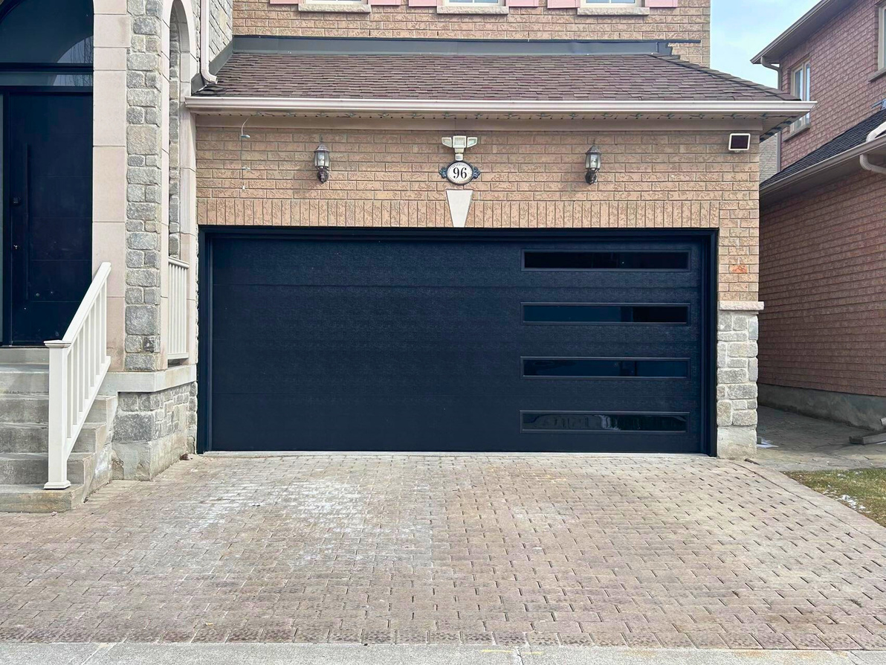

A flush garage door panel is a **sleek, minimalist style** that features a smooth and flat surface with no raised or recessed designs. It is characterized by its clean and modern aesthetic, making it a popular choice for high-end contemporary architecture.

### The Ultimate Modern Aesthetic
Flush panels are designed for homeowners who want their garage door to blend seamlessly into the home's exterior or act as a bold, solid statement piece.

* **Premium Finishes:** Exclusive access to **Matte Navy** and **Matte Black** finishes for a sophisticated, non-reflective look.
* **Heavy Duty Construction:** Built with the same **R-Value 18** and **2-inch thickness** as our textured doors for maximum protection.
* **Window Flexibility:** Works beautifully with custom window sizes like $14'' \times 40''$ or $7'' \times 64''$ for a custom designer look.

![SECONDARY_IMAGE_PLACEHOLDER: Modern flush door with vertical tinted window placement]