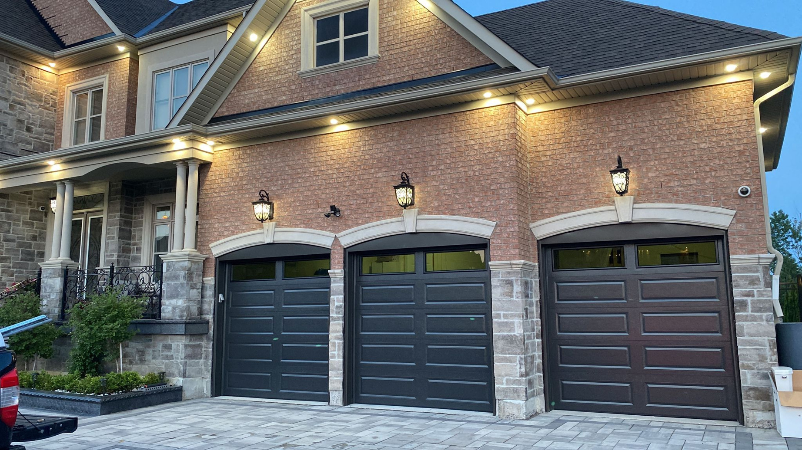

A long ranch door panel features **elongated rectangular sections** that run across the width of the door. This sleek and modern design blends traditional elements with a contemporary aesthetic, making it a perfect fit for suburban, ranch-style, or modern homes. 

### Why Choose Long Ranch Panels?
The horizontal emphasis of this design helps make your home appear wider and more grounded, offering a premium custom look without the custom price tag.

* **Thermal Performance:** Engineered with an **R-Value 18** to keep your garage warm in the winter and cool in the summer.
* **Rugged Build:** The **2-inch door thickness** and steel skin provide maximum dent resistance and security.
* **Versatile Sizing:** Available in both $8' \times 7'$ and $16' \times 7'$ configurations to fit any driveway.

![SECONDARY_IMAGE_PLACEHOLDER: Detail of Long Ranch panel texture and window layout options]