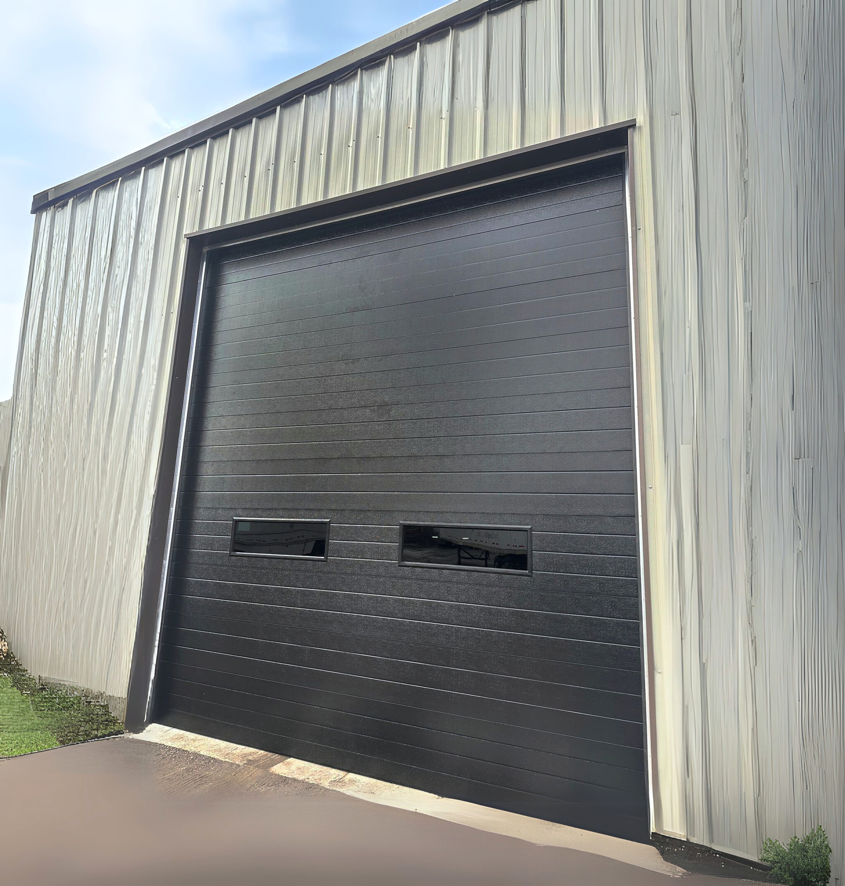

A ribbed garage door features a series of **evenly spaced, narrow horizontal or vertical ridges** (ribs) across its surface. This design provides a clean, industrial or contemporary look while offering added strength and durability.

### Performance-Driven Design
Ribbed panels are practical, low-maintenance, and versatile, making them a popular choice for both residential and commercial applications.

* **Clean Lines:** The linear design makes it highly suitable for modern homes and professional settings.
* **Durability:** The ribbed structure provides extra rigidity to the **steel skin**, making it one of our toughest panel styles.
* **Thermal Efficiency:** Includes our standard **R-Value 18** insulation to ensure your garage remains a usable space year-round.

![SECONDARY_IMAGE_PLACEHOLDER: Close up of the clean, industrial ridges on a Ribbed door]